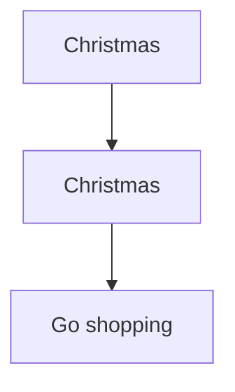

# sliding window

 - When reading the problem ask:
    - Is it contiguous?
    - If yes → *sliding window* candidate.
 - Longest / smallest / number of subarrays?
    - Then *sliding window* almost certain.
 - Can I expand right and shrink left?
    - If yes → sliding window.

## tips
### Step 1 — Identify Pattern
```sh
Fixed window?
Longest window?
Minimum window?
Count windows?
```
### Step 2 — Write Template First
```cpp
int left = 0;
for(int right = 0; right < n; right++) {

}
```
### Step 3 — Explain Window State
```sh
What makes window invalid?
```
| Problem               | Window invalid when |
| --------------------- | ------------------- |
| Longest substring     | duplicate char      |
| Character replacement | replacements > k    |
| Fruit baskets         | types > 2           |

# general template
```cpp
int left = 0;
int sum = 0;
for(int right = 0; right <m ; right++) {
    sum += nums[right];

    while(sum > k) {
        sum -= nums[left];
        left++;
    }
}
```
## 4 patterns 
## 1. fixed size

*keywords*

 - subarray of size k
 - window size k
 - average of k

*problems*
 - Maximum sum subarray of size K
 - Average of subarrays of size K
 - Number of substrings of size K

```cpp
for(int i=0; i<n; i++) {
    sum += nums[i];

    if(i >= k) {
        sum -= nums[i-k];
    }
    ans = max(ans, sum);
}
```
## 2. longest substring / subarray
*keywords*
 - longest
 - maximum length
 - at most k

*problems*
 - Longest substring without repeating characters
 - Longest repeating character replacement
 - Max consecutive ones with K flips

```cpp
int left=0;
for(int right = 0; right<n; right++) {
    add(nums[right]);

    while(invalid) {
        remove(nums[left]);
        left++;
    }
    ans = max(ans, right - left + 1);
}
```

## Pattern 3 — Minimum Window
*keywords*
 - minimum
 - smallest window
 - contains all characters
 - sum >= k

*problems*
 - Minimum window substring
 - Smallest subarray with sum ≥ K
```cpp
int left = 0;
for(int right = 0; right<n; right++) {
    add(nums[right]);

    while(valid) {
        ans = min(ans, right-left+1);

        remove(nums[left]);
        left++;
    }
}
```

## Pattern 4 — Count Valid Windows
*keywords*
 - number of subarrays
 - count substrings
 - exactly k

*problems*
 - Subarrays with K distinct integers
 - Binary subarrays with sum = K
 - Nice subarrays

```cpp
count += right-left+1;
```

